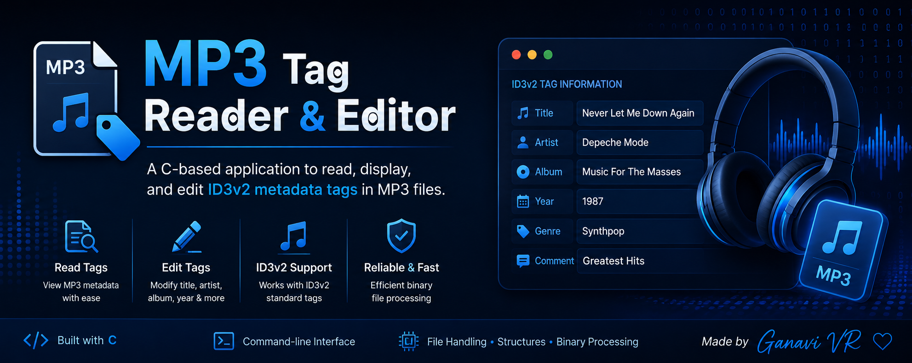

<p align="center">
  
</p>
# 🎵 MP3 Tag Reader & Editor in C

A C-based application that reads, displays, and edits **ID3v2 metadata tags** stored in MP3 files.

---

## 📌 Project Overview

This project provides a command-line interface to view and modify MP3 metadata such as:

- Song Title
- Artist
- Album
- Year
- Genre
- Comments

It demonstrates binary file handling and metadata manipulation using the ID3v2 tag format.

---

## ✨ Features

- 🎵 Read MP3 metadata
- ✏️ Edit ID3v2 tags
- 📄 Display song information
- ⚡ Fast binary file processing
- 💻 Command-line interface
- ✅ Error handling and validation

---

## 🛠️ Technologies Used

- C Programming
- File Handling
- Structures
- Binary File Processing
- ID3v2 Tag Format

---

## 📂 Project Files

```text
main.c
common.c
common.h
read.c
read.h
edit.c
edit.h
song.mp3
```

---

## 🚀 Compilation

```bash
gcc main.c common.c read.c edit.c -o mp3tag
```

---

## ▶️ Read MP3 Tags

```bash
./mp3tag -v song.mp3
```

---

## ▶️ Edit MP3 Tags

```bash
./mp3tag -e -t "New Title" song.mp3
```

---

## 📖 Learning Outcomes

- Binary file processing
- Metadata parsing
- File pointer manipulation
- Structures in C
- Command-line programming

---

## 👩‍💻 Author

**Ganavi VR**
